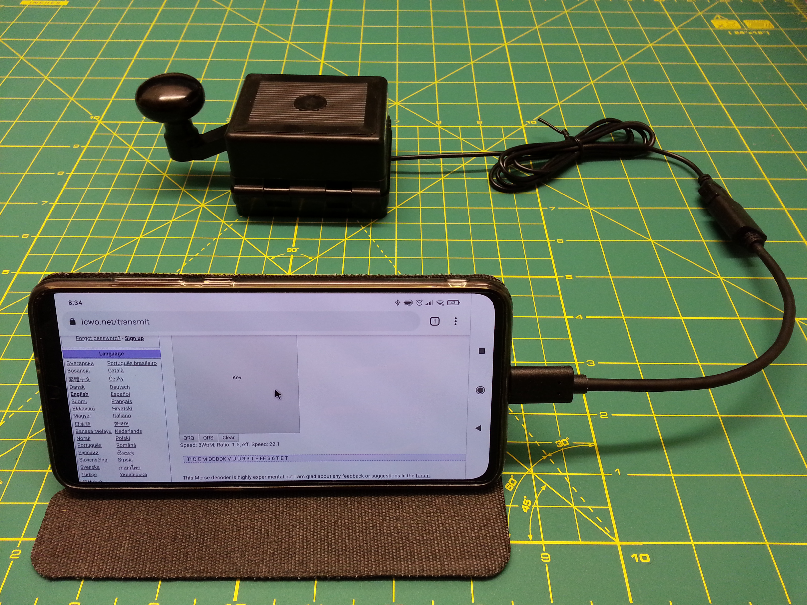
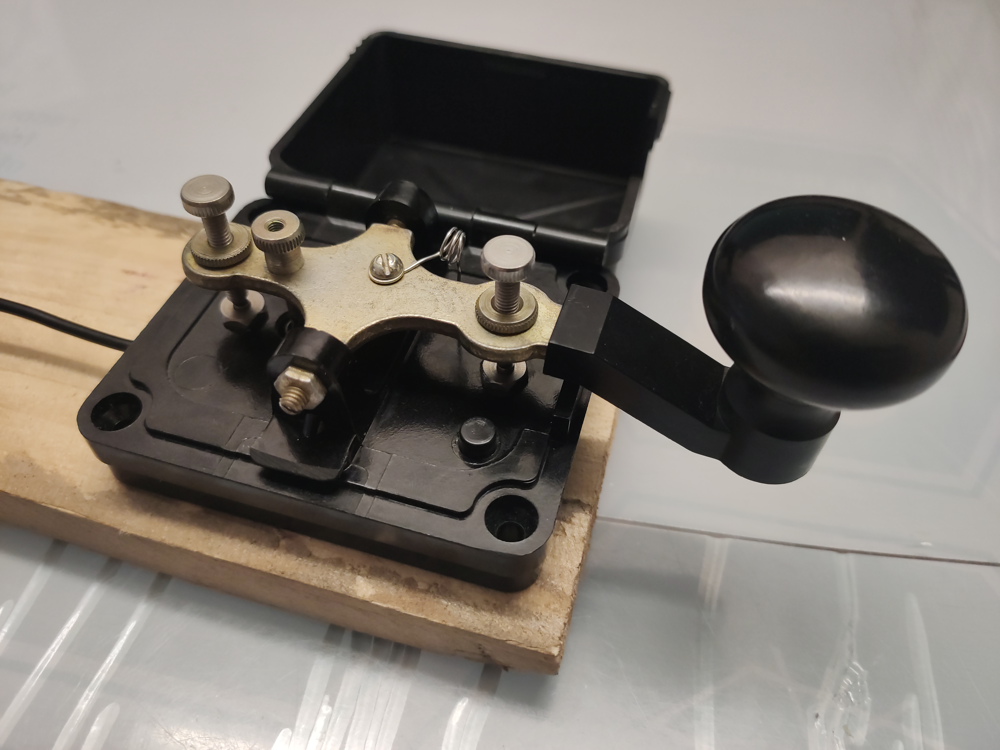
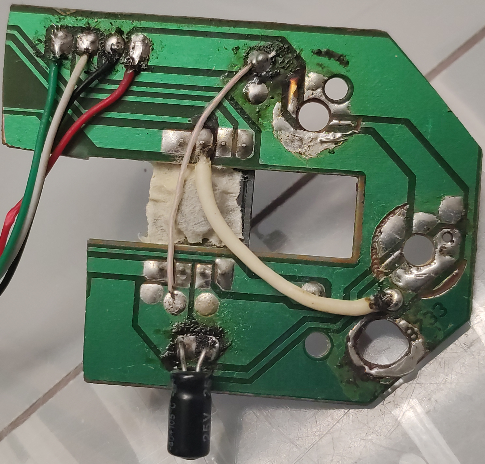

# USB-Telegraph-key

Web application. Morse code transmit trainer using a USB telegraph key.

Available at https://doliman100.com/morse-code-transmit-trainer

### Feautures
* Language: Russian
* Alphabet: Russian

### Shortcuts
* [ESC] - Settings

### Telegraph key
  

* Mouse: Oklick 115S

Based on https://lcwo.net/transmit
